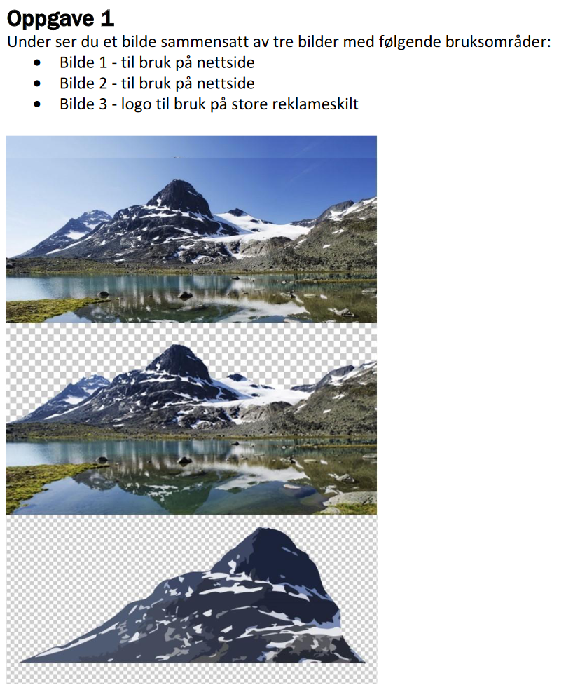
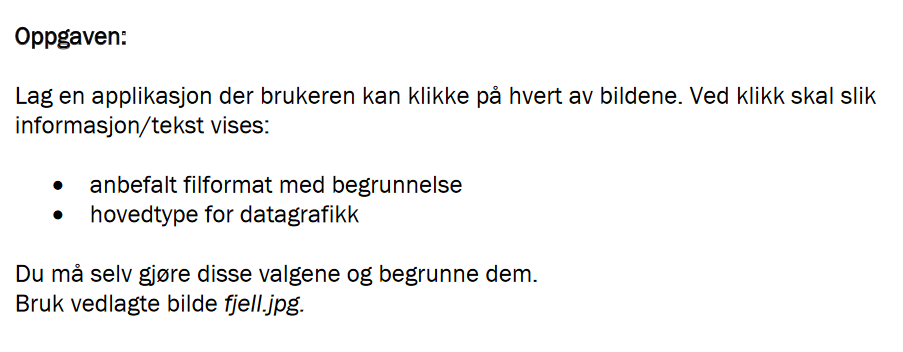

# Oppgaver 9.2

## Animasjoner og hendelser

I de følgende oppgavene skal du animere `DVD_logo.png`.
Oppgavene bygger på hverandre, så du kan gjøre alle i samme fil.

1. Få logoen til å bevege seg fra venstre mot høyre
2. Når logoen er kommet til helt høyre, skal den snu og gå tilbake igjen
3. Legg til en knapp på nettsiden som stopper animasjonen
4. Hvis animasjonen har stoppet, skal knappen starte den igjen (Du kan legge til en ny knapp, hvis du ikke klarer det med samme).
5. Legg en knapp som kjører animasjonen i dobbel fart.
6. Legg til en slider som styrer hastigheten på animasjonen
7. Hvis brukeren trykker på mellomromstasten skal animasjonen starte/stoppe

## Bilder

