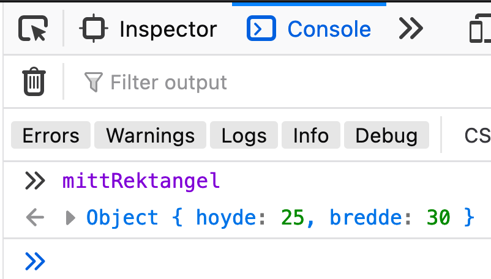

# Klasser

Klasser er maler for å lage objekter.
De lukker inn data og kode som gjør ting med den dataen, dette kalles innkapsling.

## Definere klasser

I javascript kan nøkkelordet `class`, brukes til å definere klasser.
Etter `class` skrives klassenavnet, etterfulgt av krøllparenteser `{}` som *innkapsler* klassen.
Inne i klassen skriver vi egenskaper og metoder klassen skal ha.

```js
class Rektangel {
    // ...
}
```

## Opprette objekter av klasser

For å opprette et objekt av en klasse brukes nøkkelordet `new` etterfulgt av klassenavnet og en parentes.
Objekter av en klasse vil få alle egenskapene og metodene som er definert i klassen.

```js
let mittRektangel = new Rektangel();
```

## Constructor-metoden

Constructor-meotden er en spesiell metode som kjøres når et objekt av en klasse opprettes.
Det er i denne metoden egenskapene til objektene defineres.

```js
class Rektangel {
    constructor(hoyde, bredde){
        // Objekter av klassen Rektangel får egenskapene hoyde og bredde
        this.hoyde = hoyde;
        this.bredde = bredde;
    }
}

let mittRektangel = new Rektangel(25, 30); // Oppretter et objekt med egenskapene hoyde: 25 og bredde: 30
```



```js
class Person {
    constructor(fornavn, etternavn){
        this.fornavn = fornavn;
        this.etternavn = etternavn;
        this.alder = 0;
    }
}

let kari = new Person("Kari", "Nordmann");

```

```js
let kari = {
    fornavn: "Kari",
    etternavn: "Nordmann",
    alder: 0
}
```

## Metoder

I javascript er det mulig å knytte funksjoner til objekter, slik at en funksjon kun fungere på det ene objektet. Slike funksjoner kalles metoder.

> Constructor-metoden er en metode som kjøres i det objektet opprettes.

Metoder i klasser skrives som en funksjon mellom krøllparetesene til klassen, bare uten nøkkelordet `function`.

```js
class Rektangel {
    constructor(hoyde, bredde){
        this.hoyde = hoyde;
        this.bredde = bredde;
    }
    areal(){
        return this.hoyde * this.bredde;
    }
}
```

Metoden oppfører seg som en vanlig egenskap, slik at vi kan kjøre metoden med dot-notasjon:

```js
let arealet = mittRektangel.areal();
console.log(arealet); // 750
```

### Metoder i objekter som ikke lages av klasser

Uten bruk av klasser kan vi lage en metode på følgende måte:

```js
let mittRektangelUtenKlasse = {
    hoyde: 30,
    bredde: 25,
    areal: () => {
        return this.hoyde * this.bredde;
    }
}
```

> OBS! Dette er ikke anbefalt. Hvis du skal lage en metode, bør du lage en klasse.

## Eksempler

Klasser brukes for å lage maler til objekter.

Hvis vi tenker oss at vi skal lage et program som handler om mennesker og livet.
Da kan vi lage følgdende klasse:

```js
class Person {
    constructor(fornavn, etternavn){
        this.fornavn = fornavn;
        this.etternavn = etternavn;
        this.alder = 0;
        this.kjaereste = "Ingen";
    }

    voks(){
        this.alder += 1;
    }

    hentFulltNavn(){
        return this.fornavn + this.etternavn;
    }

    slaaOpp(){
        this.kjaereste = "Ingen";
    }
}
```

Når vi oppretter et objekt av klassen `Person`, kan vi tenke på det som en fødsel.

```js
let liv = new Person("Liv Signe", "Navarsete"); // Kari blir født
let trygve = new Person("Trygve Slagsvold", "Vedum"); // Trygve blir født

liv.voks();
trygve.voks();
liv.voks();
trygve.voks();
liv.voks();
trygve.voks();

console.log(liv); // {fornavn: "Liv Signe", etternavn: "Navarsete", alder: 3, kjaereste: "Ingen"}
console.log(liv); // {fornavn: "Trygve Slagsvold", etternavn: "Vedum", alder: 3, kjaereste: "Ingen"}

liv.kjaereste = trygve;
```

